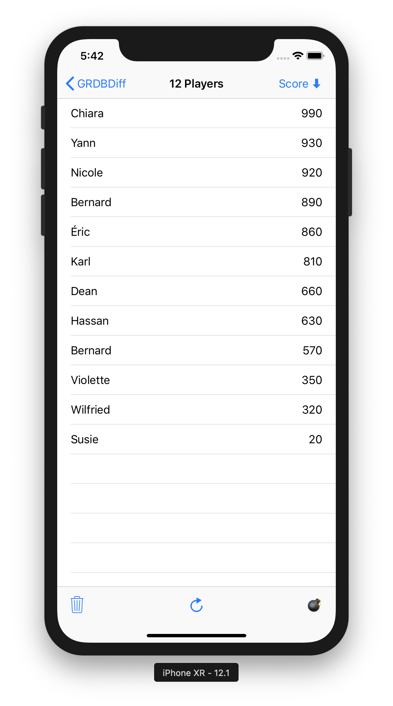
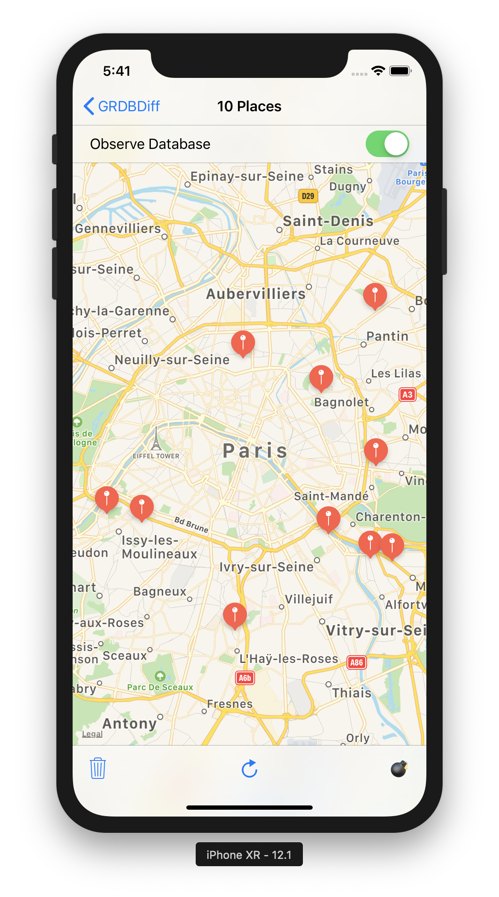

Demo Application
================

This demo application uses [GRDBDiff], [GRDB], and [Differ] to automatically synchronize its views with the content of the database.

To play with it:

1. Download the GRDBDiff repository.
2. Run `pod install` in the `Documentation/DemoApp` folder.
3. Open `DemoApp.xcworkspace`.
4. Run the DemoApp application.

The rows of the players table view animate as you change the players ordering, delete players, or refresh them (refreshing applies random transformations to the database)

The annotations of the map view move, appear, and disappear as you refresh the map view content.

In both screens, the bomb icon spawns 50 dispatch items that concurrently perform random database transformations.

| [PlayersViewController](DemoApp/PlayersViewController.swift) | [PlacesViewController](DemoApp/PlacesViewController.swift) |
| :-----: | :-----: |
|  |  |

[GRDBDiff]: https://github.com/groue/GRDBDiff
[GRDB]: https://github.com/groue/GRDB.swift
[Differ]: https://github.com/tonyarnold/Differ
