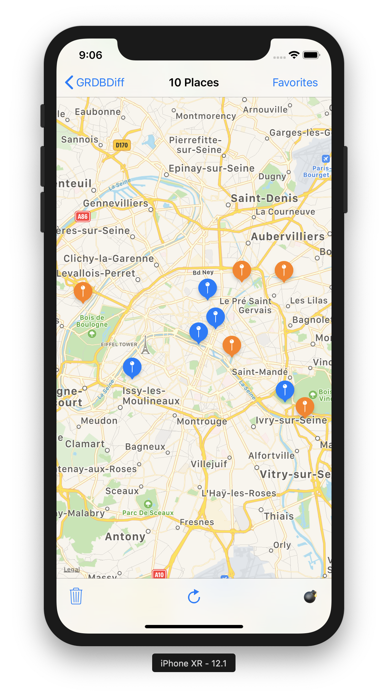

:construction: IN DEVELOPMENT - DON'T USE IN PRODUCTION :construction:

GRDBDiff
========

### Various diff algorithms for SQLite, based on [GRDB].

Since it is possible to [track database changes](https://github.com/groue/GRDB.swift/blob/master/README.md#valueobservation), it is a natural desire to compute diffs between two consecutive observed values.

**There are many diff algorithms**, which perform various kinds of comparisons. GRDBDiff ships with a few of them. Make sure you pick one that suits your needs.

- [Demo Application](#demo-application)
- [Set Differences]
- [UITableView and UICollectionView Animations]


## Demo Application

The repository comes with a [demo application] that shows you:

- How to synchronize the annotations on a MKMapView with the content of the database.
- How to animate a table view according to changes in the database.

| | |
| :-----: | :-----: |
|  |  |


## Set Differences

What are the elements that were inserted, updated, deleted?

This is the question that **Set Differences** can answer.

Set Differences do not care about the ordering of elements. They are well suited, for example, for synchronizing the annotations in a map view with the content of the database.

On the other side, they can not animate the cells in a table view or a collection view.

You track Set Differences with one of those three methods:

- [ValueObservation.setDifferencesFromRequest()]
- [ValueObservation.setDifferencesFromRequest(initialRecords:)]
- [ValueObservation.setDifferences()]

Each one of them builds a [ValueObservation] which notifies `SetDiff` values whenever the database changes:

```swift
struct SetDiff<Element> {
    var inserted: [Element]
    var updated: [Element]
    var deleted: [Element]
}
```


### ValueObservation.setDifferencesFromRequest()

#### Usage

```swift
// 1.
struct Place: FetchableRecord, TableRecord { ... }

// 2.
let request = Place.orderedByPrimaryKey()

// 3.
let placesObservation = ValueObservation.trackingAll(request)

// 4.
let diffObservation = placesObservation.setDifferencesFromRequest()

// 5.
let observer = diffObservation.start(in: dbQueue) { diff: SetDiff<Place> in
    print(diff.inserted) // [Place]
    print(diff.updated)  // [Place]
    print(diff.deleted)  // [Place]
}
```

1. Define a [Record] type that conforms to both [FetchableRecord] and [TableRecord] protocols.

    > FetchableRecord makes it possible to fetch places from the database.
    > TableRecord provides the database primary key for places, which allows to identity places, and decide if they were inserted, updated, or deleted.

2. Define a database [request] of the records you are interested in. Make sure the request is ordered by primary key. You'll get wrong results if the request is not properly ordered.

    > Ordering records by primary key provides an efficient O(N) computation of diffs.

3. Define a [ValueObservation] from the request, with the `ValueObservation.trackingAll` method.

4. Derive a Set Differences observation with the `setDifferencesFromRequest` method.

5. Start the observation and enjoy your diffs!


#### The Optional `updateRecord` Parameter

By default, the records notified in the `diff.updated` array are newly created values.

When you need to customize handling of updated records, provide a `updateRecord` closure. Its first parameter is an old record. The second one is a new database row. It returns the record that should be notified in `diff.updated`. It does not run on the main queue.

For example, this observation prints changes:

```swift
let diffObservation = placesObservation
    .setDifferencesFromRequest(updateRecord: { (place: Place, row: Row) in
        let newPlace = Place(row: row)
        print("changes: \(newPlace.databaseChanges(from: place))")
        return newPlace
    })
```

And this other one reuses record instances:

```swift
let diffObservation = placesObservation
    .setDifferencesFromRequest(updateRecord: { (place: Place, row: Row) in
        place.update(from: row)
        return place
    })
```


### ValueObservation.setDifferencesFromRequest(initialRecords:)

This method gives the same results as [ValueObservation.setDifferencesFromRequest()]. The differences are:

- The tracked record type must conform to a [PersistableRecord] protocol, on top of [FetchableRecord] and [TableRecord].

- The `initialRecords` parameter is an array of records used to compute the first diff. Make sure this array are ordered by primary key. You'll get wrong results otherwise.


### ValueObservation.setDifferences()

#### Usage

```swift
// 1.
struct Element: Identifiable, Equatable { ... }

// 2.
let elementsObservation = ValueObservation.tracking...

// 3.
let diffObservation = elementsObservation.setDifferences()

// 4.
let observer = diffObservation.start(in: dbQueue) { diff: SetDiff<Element> in
    print(diff.inserted) // [Element]
    print(diff.updated)  // [Element]
    print(diff.deleted)  // [Element]
}
```

1. Define a type that conforms to both [Identifiable] and the standard Equatable protocols.
    
    > Those two protocol allow to decide which elements they were inserted, updated, or deleted.

2. Define a [ValueObservation] which notifies elements. Elements must be sorted by identity. They must not contain two elements with the same identity. You'll get wrong results otherwise.
    
    > Ordering elements by primary key provides an efficient O(N) computation of diffs.

3. Derive a Set Differences observation with the `setDifferences` method.

4. Start the observation and enjoy your diffs!


#### The Optional `updateElement` Parameter

When you need to customize handling of updated elements, provide a `updateElement` closure. Its first parameter is an old element. The second one is a new element. It returns the element that should be notified in `diff.updated`. It does not run on the main queue.

For example, this observation reuses element instances:

```swift
let diffObservation = placesObservation
    .setDifferences(updateElement: { (old: Element, new: Element) in
        old.update(from: new)
        return old
    })
```


#### The Optional `initialElements` Parameter

The `initialElements` parameter is an array of elements used to compute the first diff. Make sure this array are ordered by identity, and does not contain two elements with the same identity. You'll get wrong results otherwise.


### The Identifiable Protocol

```swift
protocol Identifiable {
    associatedtype Identity: Equatable
    var identity: Identity { get }
}
```

Identifiable is the protocol for "identifiable" values, which have an identity.

When an identifiable type also adopts the Equatable protocol, two values that are equal must have the same identity. It is a programmer error to break this rule.

However, two values that share the same identity may not be equal. In GRDBDiff, a value has been "updated" if two versions share the same identity, but are not equal.


## UITableView and UICollectionView Animations

GRDBDiff does not ship with any diff algorithm able to perform such animation.

But you can leverage third-party libraries. See the [demo application] for an example of integration of [Differ] with GRDB.


[GRDB]: https://github.com/groue/GRDB.swift
[demo application]: Documentation/DemoApp/README.md
[Set Differences]: #set-differences
[UITableView and UICollectionView Animations]: #uitableview-and-uicollectionview-animations
[Record]: https://github.com/groue/GRDB.swift/blob/master/README.md#records
[FetchableRecord]: https://github.com/groue/GRDB.swift/blob/master/README.md#fetchablerecord-protocol
[TableRecord]: https://github.com/groue/GRDB.swift/blob/master/README.md#tablerecord-protocol
[PersistableRecord]: https://github.com/groue/GRDB.swift/blob/master/README.md#persistablerecord-protocol
[request]: https://github.com/groue/GRDB.swift/blob/master/README.md#requests
[ValueObservation]: https://github.com/groue/GRDB.swift/blob/master/README.md#valueobservation
[ValueObservation.setDifferencesFromRequest()]: #valueobservationsetdifferencesfromrequest
[ValueObservation.setDifferencesFromRequest(initialRecords:)]: #valueobservationsetdifferencesfromrequestinitialrecords
[ValueObservation.setDifferences()]: #valueobservationsetdifferences
[Identifiable]: #the-identifiable-protocol
[Differ]: https://github.com/tonyarnold/Differ
